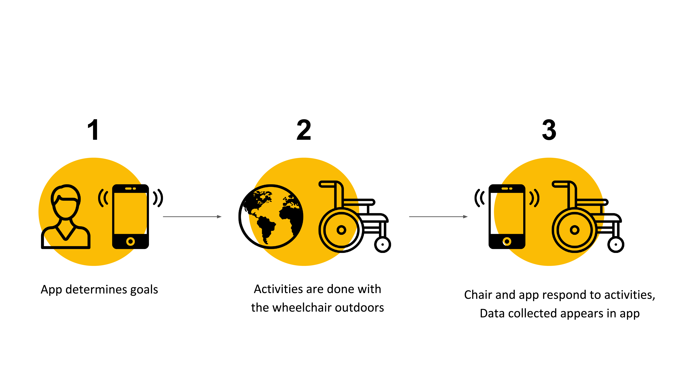
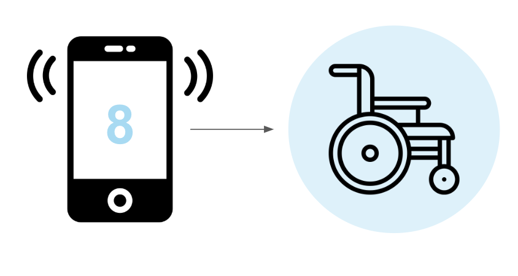
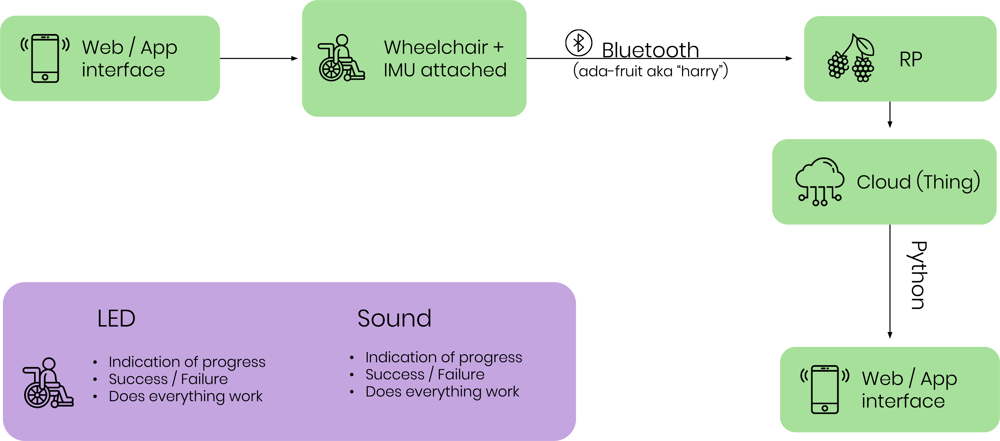
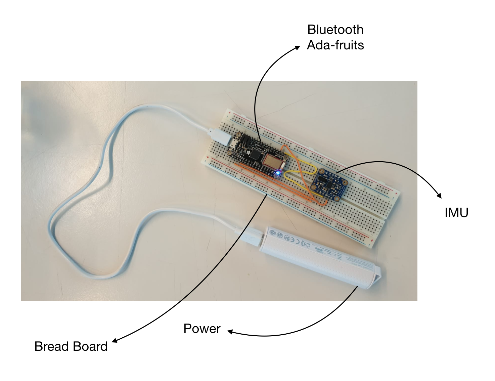
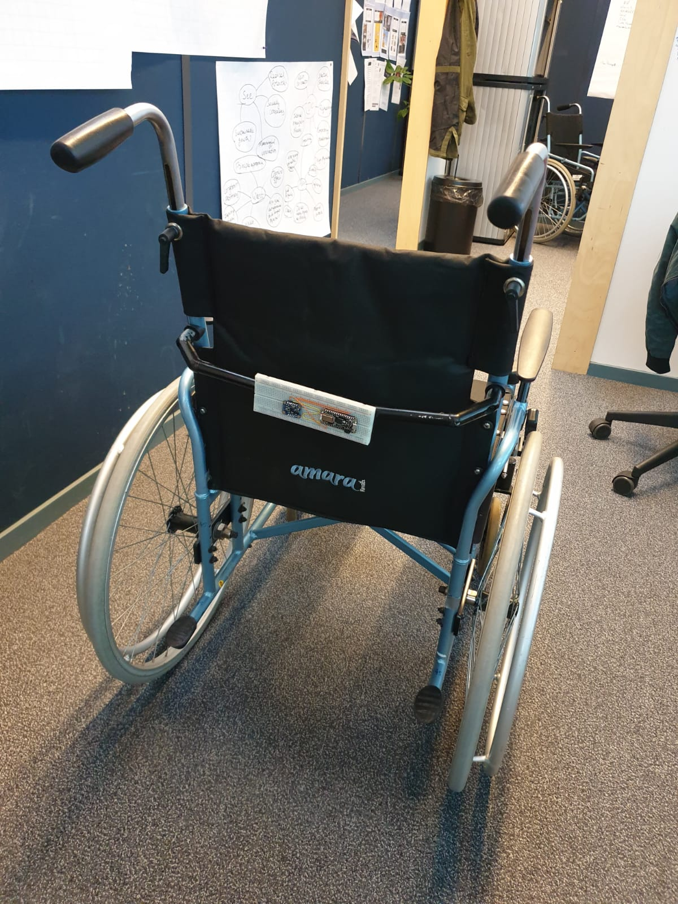

  <a href="#brainstorm">Brief Brainstorm</a>
  <a href="#theidea">The Concept</a>
  <a href="#process">The Process</a>
  <a href="#prototype">The Prototype</a>

  <h3 class="headline">Design Brief:</h3>
  

    To start off the course we received a design brief. We began by investigating the challenges and opportunities that currently exist in wheel chair use, so we could understand what could be gained by creating a connected wheel chair. 
    Our research began online and continues to interviews with two Physiotherapists and an occupational therapist student that volenteers with wheelchair users.
      
   <h5> "While the population of wheelchair users is growing worldwide, it becomes urgent to design supportive
technologies that fit their needs. We aim to develop products for improvement of the wheelchair users’ wellbeing. This design is a connected product that collects
data from sensors, processes it in order to actuate user
interactions embedded on the wheelchair."</h5>
      
    
  We began our design process by creating an overview of our initial associations and the potential sensors and actuators that we could come up with. We used this overview to gather potential applications and map our primary associations. This session helped us form several ideas for a connected wheelchair:
  
  

  

  <h4>Being Superheros</h4>
   
  A bit of research taught us that while using a wheelchair, things are often out of reach or missplaced. Some things might be too high for a wheel chair user, for example, a mirror in the bathroom or the heater button.
    
  Thinking of smart houses, we envisioned a house where objects move to adjust themselves to a wheelchair user. The door can open automaticly, the mirror could change it's angel to the right position and the heating could turn on.
    
<b>System:</b> Chair > Object in Physical world (an App interface to control preferences) 
<b>Optional Sensors:</b> Movement, Voice control, GPS, Touch, Gyroscope  
<b>Optional Actuators:</b> Speakers, LEDs, vibration

  

  

   <h4>Getting Around</h4>
     
    Can we help people to get around more easily?
     
    We envisioned "Google maps" for wheelchair users, suggesting routes considering their limitations and best journies. We   thought this could be helpful in different environments such as hospitals, big buildings like the TU or other universities, or in general in the city
  
<b>System:</b> App > Chair > Physical world > App 
<b>Optional Sensors:</b> Touch, Acceleration, GPS, Compass, Distance, Movement 
  <b>Optional Actuators:</b> Speakers, LEDs, vibration, screen

  

  

    <h4>Increasing Safety</h4>
     
    Can we make it safer to use a wheelchair on the go?
     
    Insired by different insurance and driving apps, we envisioned an app that actively monitors ground quality to signal the user to drive quality on unstable ground. In addition to that, the app could report selected contacts about possible dangours or accidents to increase safety and independence for the wheelchair user. By applying accident detection, panic button, collision detection and more, we hope to make the wheelchair experience as safe as possible
      
  <b>System:</b> Physical world > Chair > App 
  <b>Optional Sensors:</b> Touch, Gyroscope, Acceleration, GPS, Distance, temperature, Movement, voice 
  <b>Optional Actuators:</b> Speakers, LEDs, vibration, screen

  

  

    <h4>Be Active</h4>
     
    How can we help wheelchair users to enjoy physical activity more?
     
    Inspired bu various fitness apps, we envisioned a product that would enable wheelchair users to become more active and spend more time outside. The app would connect to the chair and collect different fitness data such as amount of fource put on the heels, kilometers driven in different angels etc
    
  <b>System:</b> Physical world > Chair > App 
  <b>Optional Sensors:</b> Gyroscope, Acceleration, GPS, Distance 
  <b>Optional Actuators:</b> Speakers, LEDs, vibration, screen
  

  

    <h4>Gamify It</h4>
     
    Focusing mostly on kids, or people who are in the wheelchairs for short-term revalidation in hospitals, we were inspired by pokemon go. We envisiones a connected wheelchair that enables overcoming obstacles, finding best routes and using the chair to play games with other wheelchair users
      
  <b>System:</b> App > Chair > Physical world  > App 
  <b>Optional Sensors:</b> Touch, Voice control, GPS, Compass, Distance, Movement 
  <b>Optional Actuators:</b> Speakers, LEDs, vibration, screen
  

  <h3 class="headline">The Final Concept:  Basic wheelchair skills gamification</h3>
  For our final conecpt, we chose to focus on the first experience of a user with a wheel chair. We designed
   a connected wheelchair that helps teach basic wheelchair skills. Our goal is to use the connected prototype in order to test it with kids and perform user research. 
   We want to test the ability of the gamification of the wheelchair experience to simplify and shorten the learning curve of basic wheel chair skills.
    
  <h4 class="secondary">Target Users:</h4>
 <ul>
   <li>Main target: Kids in the age of 6-12</li>
  <li>Secondary users: Temporary users in hospital or first timers</li>
  <li>Anyone interested in learning basic wheelchair skills</li>
  </ul>

 
         
  <h4 class="secondary">Goals:</h4>
The goal of the product is to teach kids the basic wheelchair activities in a fun and playfull manner. A secondary goal is to use the data collected to learn about the way kids adapt to wheelchairs, the speed in which they learn and the level of difficulty of the different activities. The goal of the prototype is to test the usability of the product. Both the web interface and the physical experience. We aim to learn if this product can create value to its target audience, and make to learning process more enjoyable
  

<ul>
  <li>Gamify simple tasks that involve wheelchair skills</li>
<li>Encourage kids in wheelchairs to be active and play outside</li>
<li>Create a community</li>
<li>Teach basic wheelchair skills</li>
<li>Learn about wheelchair first timers</li>
</ul>

<h4 class="secondary">Architecture</h4>

The user will receive a task from an app, which he will execute with the wheelchair. The app would indicate how well the task was performed and will enable the user to try again or try a different task

  

A possible example for a task: “Create a full circle to the right side”. The task would have a timer counting the time it took the user to complete the circle. A visual on the screen will indicate to the user the progress in percents. After the task is complete the user will receive starts to indicate how well he performed the task based on time. 1 star would indicate basic skills and 3 starts would indicate professional skills.The task can become more difficult over time by doing the same thing while going uphill or on a different surface such as grass or sand

  

<ul>
<li>System: App > User > Physical world > Wheelchair > App</li>
<li>Optional Sensors: Movement, Acceleration, Touch, Measure the angle</li>
<li>Optional Actuators: Speakers, LEDs, vibration</li>
 </ul>

  

<h4 class="secondary">Data:</h4>
<b>Data collected:</b>  
Speed on different surfaces, angles, time it taked to perform various activities such as complete a circle, reverse etc  
<b>The data collected can teach us about: </b>
<ul>
  <li>The behaviour of kids when they use a wheelchair for the first time</li>
  <li>What skills are more challenging for kids to learn when using a wheelchair for the first time</li>
  <li>The time it takes to perform different activities with a wheelchair</li>
  <li>The learning curve of different skills, and how can we improve it</li>
  </ul>
<b>Possible stakeholders:</b> 
<ul>
  <li>Wheelchairs engineers and designers </li>
  <li>Doctors</li>
  <li>Physiotherapists</li>
  <li>Occupational therapists</li>
  <li>Families of kids with wheelchair</li>
  <li>Researchers </li>
 </ul>

<h3 class="headline">The process</h3>
  

    <h4 class="secondary">1. Create a new Github project</h4>
     
For managing our collaborative work on this digital project we used an organizational GitHub account, which allowed us to store different versions of our codes and work from different pc's on the same files. An additional added value of using GitHub is that within its interface, an option is built in that allows one to quickly convert code documents into a presentable website. Be careful to create an organizational account instead of a normal user account; you will need the account to be organizational in order to be able to grant everybody administrative permission, so that all your teammembers can edit the GitHub pages if necessary. 

    <h4 class="secondary">2. Set-up the Raspberry Pi</h4>
      
The Raspberry Pi (Pi from now) serves as the most important node within our project, collecting the data from the Adafruit bluetooth board, doing calculations on the raw data in a python file and then displaying this data on the server it is running.   We started working with a clean install of Raspbian. To be able to work with the Pi, beware that you will need a keyboard, a mouse and a screen with HDMI gate. First, the Pi had to be set up to recognize the Eduroam network. Then, through the terminal on the Pi, download a copy of the GitHub project folder. For more indepth instructions, please refer to <a href="https://datacentricdesign.org/docs/2019/04/30/platform-raspberrypi">this tutorial</a>. 

  <h4 class="secondary">3. Build the Adafruit breadboard</h4>
      
The core sensor to our project was the BNO055 IMU sensor; this is a 9 axes accelerometer that can detect movement, rotation and accelerations. For now, we're only referring to one axis: the vertical rotation. This IMU sensor is connected to the Adafruit Sensor according to the schematic that can be seen below:</p<
        <ul>
          <li>3V on Adafruit to Vin on IMU - power supply for the IMU sensor</li>
          <li>SDA on IMU to SDA on Adafruit - dataline to communicate measured data</li>
          <li>SCL on IMU to SCL on Adafruit - clockline to synchronise the communicated data</li>
          <li>GND on IMU to GND on Adafruit - grounding the IMU sensor</li>
        </ul>

  

    <h4 class="secondary">4. Download Arduino and install libraries</h4>
  
In order to be able to work with the adafruit, we need to do some quick setup. First of all, one is required to install <a href="https://www.arduino.cc/">the Arduino software</a> and install the following libraries within the arduino code, by going to Sketch -> Include Library -> Manage Libraries:

        <ul>
          <li>Bluefruit nRF51</li>
          <li>Adafruit Unified Sensor</li>
        </ul>
  
Then, go to 'preferences' and next to the field "Additional Boards Manager URLs:" click on the button with two overlapping rectangles, all the way to the right. Copy-paste “https://adafruit.github.io/arduino-board-index/package_adafruit_index.json" into this window, then click 'OK' in this screen and in the 'Preferences' window. 

    <h4 class="secondary">5. Upload arduino code to Adafruit</h4>
  
Download <a href="https://github.com/Gal-E/ID1545/tree/master/arduino/IMU_detector">the following arduino file</a> and open it in the arduino software. Push the arrow in the top bar of the Arduino interface to 

    <h4 class="secondary">6. Write a python file for subscribe_gatt_orientation.py</h4>
    <h4 class="secondary">7. Add socket code to launch a server</h4>
    <h4 class="secondary">8. Write html code, download javascript code for interface</h4>
    
To create a web interface for the prototype, we decided to use an existing JS library and adjust it to out needs. We wanted to create a circle to indicate the movement that occurs in the physical world with the chair. We tried different libraries until we chose the one that suited our needs most. At first we used a loader JS library. It looked great but we realized that making it work for left and right circles we would have to re-write quite a lot of the code. We decided to try a different library and chose to use a pie chart. That way, both sides of the circle are supported. The angles start at -100 and reach 100. A circle to the left would be with a negative value, and a circle to the right would be with a positive value.

    <h4 class="secondary">9. Run python script on Raspberry Pi</h4>

<h3 class="headline">The prototype</h3>

While developing the prototype we faced many questions: What is the best place on the chair to attach the board? What type of angle should we monitor in order to test a full circle? What should happen when a circle is complete? etc. The ability to physically test the different options helped us make the right decisions.

  

 

    <video controls autoplay class="firstVideo">
        <source src="images/video.mp4" type="video/mp4">
    </video>
    

<h5>The Final Prototype</h5>

The final prototype consists of a web interface that demonstrates the circle done with the wheelchair. As the chair rotates, the circle in the web application gets fuller, thus indicating the percents of the circle that have been complete. Once the circle is complete, there is a confetti animation and a success sound, letting the user know he completed the exercise. This can be seen in the video bellow. The first video records the activity on the screen. In the console log you can see how we track every angle, and the visual on the screen changes to reflect that to the user (The numbers 0 - 100 indicate angle 0 untill angle 360). In the second video, you can see how the prototype is being used, while the web app appears on the users phone.

 

  <video controls autoplay class="protoVideo">
      <source src="images/video2.mp4" type="video/mp4">
  </video>
  <video controls autoplay class="protoVideo">
      <source src="images/video3.mp4" type="video/mp4">
  </video>
