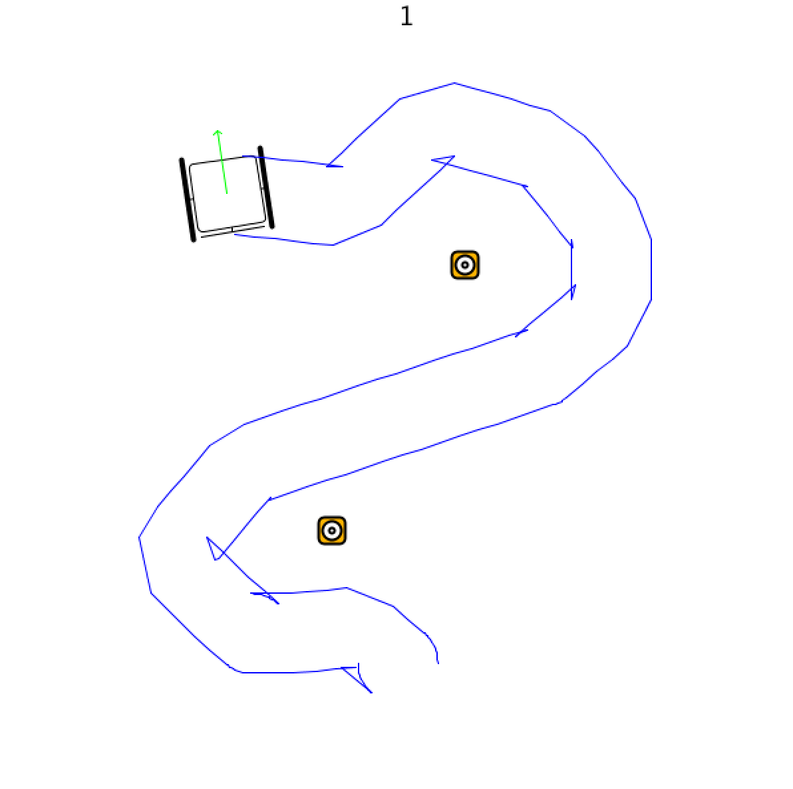

  <a href="#brainstorm">Brief Brainstorm</a>
  <a href="#theidea">The Idea</a>
  <a href="#process">The Process</a>
  <a href="#prototype">The Prototype</a>

  <h3 class="headline">Kick Off - Brief Brainstorm:</h3>
  

  To start off by investigating the challenges and opportunities that could be gained by upgrading a wheelchair to a digitally connected one, we began by creating an overview of our initial associations and the potential sensors and actuators that we could come up with.  

  We used this overview to gather potential applications and map our primary associations. This session helped us form several ideas for a connected wheelchair:
  
 
  
  

  <h4>1 - Giving the users superpowers</h4>
   
  A bit of research taught us that while using a wheelchair, things are often out of reach or missplaced. Some things might be too high for a wheel chair user, for example, a mirror in the bathroom or the heater button.
   
  Thinking of smart houses, we envisioned a house where objects move to adjust themselves to a wheelchair user. The door can open automaticly, the mirror could change it's angel to the right position and the heating could turn on.
  
 
  
  

   <h4>2 - Getting around</h4>
     
    Can we help people to get around more easily?
     
    We envisioned "Google maps" for wheelchair users, suggesting routes considering their limitations and best journies. We   thought this could be helpful in different environments such as hospitals, big buildings like the TU or other universities, or in general in the city

  
 

  

    <h4>3 - Increasing safety</h4>
     
    Can we make it safer to use a wheelchair on the go?
     
    Actively monitoring ground quality to signal the user to drive quality on unstable ground
    Accident detection
    Heart attack
    Alarm
    Panic button
    911
    Collision detection
    Driving backwards indicators
  
 

  

    <h4> 4 - Sports</h4>
     
    How can we help wheelchair users to enjoy physical activity more?
     
    Distances covered 
    App with fitness data
    That actively motivates you to be more active
    Gloves to help keep your hands clean
    Measure the amount of force put on the wheels
    Revalidation?

  
 

  

    <h4> 5 - Gamify it</h4>
     
    Might especially be fun for kids, or people who are in the wheelchairs for short-term revalidation
    In hospitals? → getting around or over obstacles, finding the best route
    Hide and seek. Inspiration: Pokemon Go
  

 

  <h3 class="headline">The chosen concept</h3>
  explaination about idea
   
  <h4>Target Users:</h4>

- kids age 8-10
- temporary users in hospital
- first timers

<h4>Goals:</h4>

- Gamify simple tasks that involve wheelchair skills
- Encourage kids in wheelchairs to be active and play outside
- Create a community
- Teach basic wheelchair skills

- System: App > User > Physical world > Wheelchair > App
- Optional Sensors: Movement, Acceleration, Touch, Measure the angle 
- Optional Actuators: Speakers, LEDs, vibration

Eg task: “Drive in a circle and use your hands 8 times or less”
The task can become more difficult over time by doing the same thing while going uphill or on a different surface such as grass or sand

<h4>Data:</h4>
- Data collected: Speed on different surfaces, angles
- The data collected can teach us about the behaviour of kids when they use a wheelchair for the first time
- Maybe we can learn about what skills are more challenging for kids to learn when using a wheelchair for the first time
- Possible stakeholders who can benefit from this information: wheelchairs engineers and designers that could improve functionality based on that, doctors and families of kids with wheelchair that can help kids get easily adjusted to the chair etc

<h4>Architecture</h4>

  <h3 class="headline">The process</h3>
#### First milestone:
- Create a system that detects when a user has driven a circle.

<h4>Progress made:</h4>
Monday 23rd September:
- Finished tutorial 

Monday 30th September:
- Made it possible to communicate data between the raspberry Pi and a connected arduino. The LED seems to be responding to the device, however it is doing so in a very arythmic fashion. Needs some more work then.

Friday 4th October:
- Almost got our circle detection code to work! :-)

Monday 7th October:
- Managed to get circle counting code to work in SGO file.

Friday 11th October: 
- Managed to write circle detection code in Processing! 
- Created simulator to fully understand how it works. 
- We translated code to python and we're testing it to make sure it detects circles to both sides

Monday 14th October:
- Bluetooth chip is finally working! 
- We managed to debug the circle detection, and now aim to figure out how to display it on the server

Friday 18th October:
- We got the circle progress to show on the server running on the Pi, but it is a bit jumpy.

Monday 20th October:
- Turns out the jumpy data was just a poorly placed send to the server, so that was easily solved.

Friday 

<h3 class="headline">The prototype</h3>
