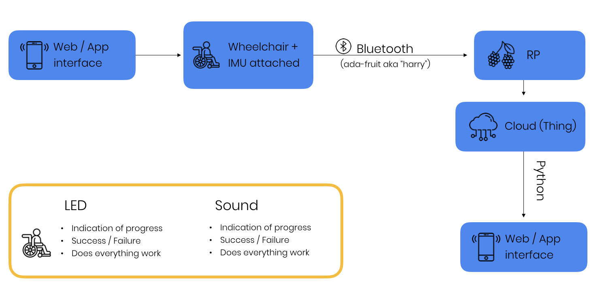

#### Target Users:

- kids age 8-10
- temporary users in hospital
- first timers

#### Goals:

- Gamify simple tasks that involve wheelchair skills
- Encourage kids in wheelchairs to be active and play outside
- Create a community
- Teach basic wheelchair skills

- System: App > User > Physical world > Wheelchair > App
- Optional Sensors: Movement, Acceleration, Touch, Measure the angle 
- Optional Actuators: Speakers, LEDs, vibration

Eg task: “Drive in a circle and use your hands 8 times or less”
The task can become more difficult over time by doing the same thing while going uphill or on a different surface such as grass or sand

#### Data:
- Data collected: Speed on different surfaces, angles
- The data collected can teach us about the behaviour of kids when they use a wheelchair for the first time
- Maybe we can learn about what skills are more challenging for kids to learn when using a wheelchair for the first time
- Possible stakeholders who can benefit from this information: wheelchairs engineers and designers that could improve functionality based on that, doctors and families of kids with wheelchair that can help kids get easily adjusted to the chair etc

#### First milestone:
- Create a system that detects when a user has driven a circle.

#### Progress made:
Monday 23rd September:
- Finished tutorial 

Monday 30th September:
- Made it possible to communicate data between the raspberry Pi and a connected arduino. The LED seems to be responding to the device, however it is doing so in a very arythmic fashion. Needs some more work then.

Friday 4th October:
- Almost got our circle detection code to work! :-)

Monday 7th October:
- Managed to get circle counting code to work in SGO file.

Friday 11th October:
- Added rotatition detection code, but bluetooth chip died and there still is some final debugging to do.

Monday 14th October:
- Bluetooth chip is still not working, so we cannot progress with anything, since the circle detection can only be debugged if we can see how the data from the bluetooth chip is being handled.

#### Architecture

Friday 11th October: 
- Managed to write circle detection code in Processing! 
- Created simulator to fully understand how it works (ATTACH SCREEN SHOT HERE!). 
- We translated code to python and we're testing it to make sure it detects circles to both sides
