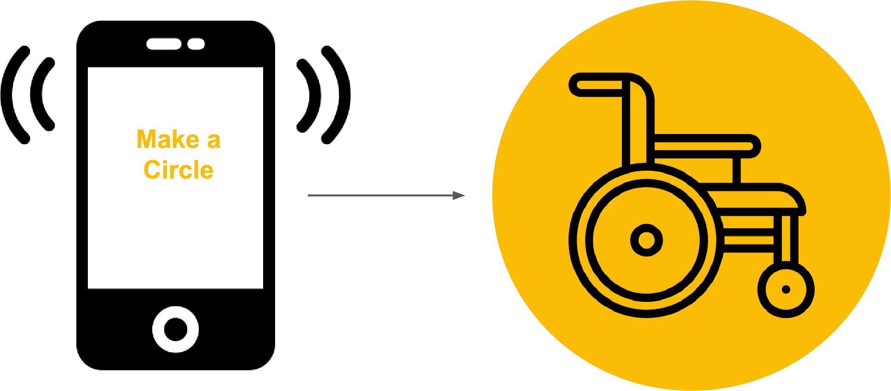

  <a href="#brainstorm">Brief Brainstorm</a>
  <a href="#theidea">The Idea</a>
  <a href="#process">The Process</a>
  <a href="#prototype">The Prototype</a>

  <h3 class="headline">Kick Off - Brief Brainstorm:</h3>
  

  To start off by investigating the challenges and opportunities that could be gained by upgrading a wheelchair to a digitally connected one, we began by creating an overview of our initial associations and the potential sensors and actuators that we could come up with. We used this overview to gather potential applications and map our primary associations. This session helped us form several ideas for a connected wheelchair:
  
  
  
  

  <h4>Being Superheros</h4>
   
  A bit of research taught us that while using a wheelchair, things are often out of reach or missplaced. Some things might be too high for a wheel chair user, for example, a mirror in the bathroom or the heater button.
    
  Thinking of smart houses, we envisioned a house where objects move to adjust themselves to a wheelchair user. The door can open automaticly, the mirror could change it's angel to the right position and the heating could turn on.
    
<b>System:</b> Chair > Object in Physical world (an App interface to control preferences) 
<b>Optional Sensors:</b> Movement, Voice control, GPS, Touch, Gyroscope  
<b>Optional Actuators:</b> Speakers, LEDs, vibration

  

  
  

   <h4>Getting Around</h4>
     
    Can we help people to get around more easily?
     
    We envisioned "Google maps" for wheelchair users, suggesting routes considering their limitations and best journies. We   thought this could be helpful in different environments such as hospitals, big buildings like the TU or other universities, or in general in the city
  
<b>System:</b> App > Chair > Physical world > App 
<b>Optional Sensors:</b> Touch, Acceleration, GPS, Compass, Distance, Movement 
  <b>Optional Actuators:</b> Speakers, LEDs, vibration, screen

  

  

    <h4>Increasing Safety</h4>
     
    Can we make it safer to use a wheelchair on the go?
     
    Insired by different insurance and driving apps, we envisioned an app that actively monitors ground quality to signal the user to drive quality on unstable ground. In addition to that, the app could report selected contacts about possible dangours or accidents to increase safety and independence for the wheelchair user. By applying accident detection, panic button, collision detection and more, we hope to make the wheelchair experience as safe as possible
      
  <b>System:</b> Physical world > Chair > App 
  <b>Optional Sensors:</b> Touch, Gyroscope, Acceleration, GPS, Distance, temperature, Movement, voice 
  <b>Optional Actuators:</b> Speakers, LEDs, vibration, screen
    
  

  

    <h4>Be Active</h4>
     
    How can we help wheelchair users to enjoy physical activity more?
     
    Inspired bu various fitness apps, we envisioned a product that would enable wheelchair users to become more active and spend more time outside. The app would connect to the chair and collect different fitness data such as amount of fource put on the heels, kilometers driven in different angels etc 
    
  <b>System:</b> Physical world > Chair > App 
  <b>Optional Sensors:</b> Gyroscope, Acceleration, GPS, Distance 
  <b>Optional Actuators:</b> Speakers, LEDs, vibration, screen
  

  

    <h4>Gamify It</h4>
     
    Focusing mostly on kids, or people who are in the wheelchairs for short-term revalidation in hospitals, we were inspired by pokemon go. We envisiones a connected wheelchair that enables overcoming obstacles, finding best routes and using the chair to play games with other wheelchair users
      
  <b>System:</b> App > Chair > Physical world  > App 
  <b>Optional Sensors:</b> Touch, Voice control, GPS, Compass, Distance, Movement 
  <b>Optional Actuators:</b> Speakers, LEDs, vibration, screen
  

  <h3 class="headline">The Final Concept: Basic wheelchair skills gamification</h3>
  For our final conecpt, we chose to use a connected wheelchair to teach basic wheelchair skills, and gamify the wheelchair experience.
   
  <h4 class="secondary">Target Users:</h4>
 <ul>
   <li>Main target: Kids in the age of 6-12</li>
  <li>Secondary users: Temporary users in hospital or first timers</li>
  <li>Anyone interested in learning basic wheelchair skills</li>
  </ul>

  <h4 class="secondary">Goals:</h4>
The goal of the product is to teach kids the basic wheelchair activities in a fun and playfull manner. A secondary goal is to use the data collected to learn about the way kids adapt to wheelchairs, the speed in which they learn and the level of difficulty of the different activities
 
- Gamify simple tasks that involve wheelchair skills
- Encourage kids in wheelchairs to be active and play outside
- Create a community
- Teach basic wheelchair skills
- Learn about wheelchair first timers
<h4 class="secondary">Architecture</h4>

The user will receive a task from an app, which he will execute with the wheelchair. The app would indicate how well the task was performed and will enable the user to try again or try a different task 

A possible example for a task: “Create a full circle to the right side”. The task would have a timer counting the time it took the user to complete the circle. A visual on the screen will indicate to the user the progress in percents. After the task is complete the user will receive starts to indicate how well he performed the task based on time. 1 star would indicate basic skills and 3 starts would indicate professional skills.The task can become more difficult over time by doing the same thing while going uphill or on a different surface such as grass or sand

<ul>
<li>System: App > User > Physical world > Wheelchair > App</li>
<li>Optional Sensors: Movement, Acceleration, Touch, Measure the angle</li> 
<li>Optional Actuators: Speakers, LEDs, vibration</li>
 </ul>

<h4 class="secondary">Data:</h4>
<b>Data collected:</b> Speed on different surfaces, angles
<b>The data collected can teach us about: </b> 
- the behaviour of kids when they use a wheelchair for the first time
- Maybe we can learn about what skills are more challenging for kids to learn when using a wheelchair for the first time
- Possible stakeholders who can benefit from this information: wheelchairs engineers and designers that could improve functionality based on that, doctors and families of kids with wheelchair that can help kids get easily adjusted to the chair etc

  <h3 class="headline">The process</h3>
#### First milestone:
- Create a system that detects when a user has driven a circle.

<h4 class="secondary">Progress made:</h4>
Monday 23rd September:
- Finished tutorial 

Monday 30th September:
- Made it possible to communicate data between the raspberry Pi and a connected arduino. The LED seems to be responding to the device, however it is doing so in a very arythmic fashion. Needs some more work then.

Friday 4th October:
- Almost got our circle detection code to work! :-)

Monday 7th October:
- Managed to get circle counting code to work in SGO file.

Friday 11th October: 
- Managed to write circle detection code in Processing! 
- Created simulator to fully understand how it works. 
- We translated code to python and we're testing it to make sure it detects circles to both sides

Monday 14th October:
- Bluetooth chip is finally working! 
- We managed to debug the circle detection, and now aim to figure out how to display it on the server

Friday 18th October:
- We got the circle progress to show on the server running on the Pi, but it is a bit jumpy.

Monday 20th October:
- Turns out the jumpy data was just a poorly placed send to the server, so that was easily solved.

Friday 

<h3 class="headline">The prototype</h3>
